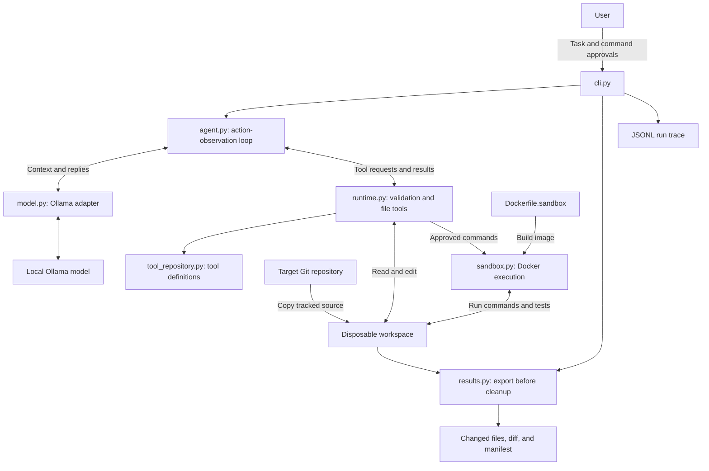

# Coding harness

A Python CLI that uses a local Ollama model to edit a disposable copy of a Git
repository. Commands run in Docker after human approval. Results are exported
for review; the original repository stays unchanged.

## Structure

- `coding_harness/cli.py`: task input, progress, and run output.
- `agent.py` and `model.py`: agent loop and Ollama connection.
- `runtime.py`, `tool_repository.py`, and `sandbox.py`: validated file tools and Docker execution.
- `results.py`: changed files and diff export.
- `tests/`: automated tests and live containment checks.
- `Dockerfile.sandbox`: execution image.



## Setup

Install **Python 3.14**, **Git**, **Ollama**, and **Docker Desktop**. Start Docker
Desktop with Linux containers. The harness uses only Python's standard library;
no Python packages or API keys are required.

Run these commands in PowerShell from this project's directory:

```powershell
py -3.14 -m venv .venv
ollama pull qwen2.5-coder:3b
Get-Content Dockerfile.sandbox -Raw | docker build -t coding-harness-sandbox:local -
```

Keep Ollama running. If it is not already running, open another terminal and run
`ollama serve`. The harness connects to `http://127.0.0.1:11434`.

## Run

Replace the repository path and task below with your own:

```powershell
.\.venv\Scripts\python.exe -m coding_harness --root "C:\path\to\target-repository" --task "[TASK]" --max-turns 15
```

The target must be a local Git repository without secrets. Only visible tracked
files are copied, so add any intended input files to Git first. Every Bash
command prompts for approval: enter exactly `y` to allow it, or anything else to deny it.

To use another installed Ollama model, set `$env:OLLAMA_MODEL = "model-name"`
before running the command.

## Results

The CLI prints progress, termination status, changed files, and the output paths.
Each run saves a JSONL trace and a results directory under `traces/` containing:

- `files/`: final contents of added and modified files.
- `changes.diff`: unified text diff; binary changes are identified.
- `changes.json`: additions, modifications, and deletions.

Review these artifacts before applying changes yourself. The model's final
summary is unverified; command output and exit codes are recorded in the trace.
